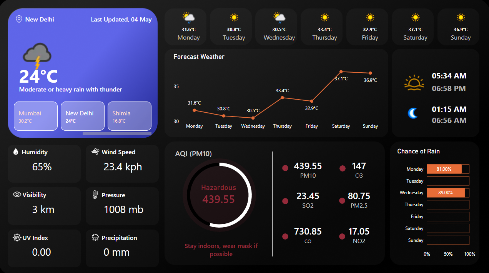
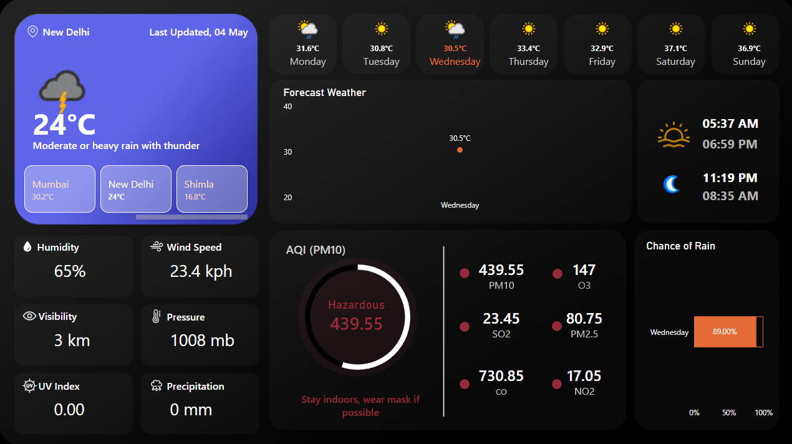

# 🌍 Air Quality Analytics Dashboard (Power BI)

## 📊 Overview

This project presents an interactive Power BI dashboard designed to analyze air quality and weather conditions for better environmental insights.

The dashboard enables users to monitor pollution levels, understand trends, and make informed decisions regarding outdoor activities.

---

## 🎯 Business Objective

Air quality directly impacts public health and daily decision-making.

This dashboard aims to:

* Provide real-time visibility into pollution levels
* Classify air quality into actionable categories
* Offer health-based recommendations
* Help users plan activities based on weather and air conditions

---

## 📈 Key Insights

* PM10 levels indicate **hazardous air conditions**, requiring precautionary measures
* Temperature trends show **increasing patterns toward the weekend**
* Rain probability varies across days, impacting outdoor planning
* Multiple pollutants contribute differently to overall air quality

---

## 🧩 Features

* 🎨 Dynamic KPI cards with condition-based color coding
* 🌫 AQI classification with health status (Good → Hazardous)
* 💡 Smart suggestions based on pollution levels
* 📈 Weekly temperature trend analysis
* 🌧 Rain probability visualization
* 🌅 Sunrise & 🌙 Moonrise timing display
* 🌙 Clean and modern dark-themed UI

---

## 📸 Dashboard Preview

### 🖥 Full Dashboard

### 📈 Forecast Section

---

## 🛠 Tools & Technologies

* Power BI
* DAX (Data Analysis Expressions)
* Data Modeling

---

## 🧠 Key Learnings

* Implemented dynamic measures for conditional formatting
* Designed pollutant-specific threshold logic
* Built a user-friendly and visually intuitive dashboard
* Applied data storytelling principles for business insights

---

## ⚠️ Notes

* Data used is based on API responses and may not follow standard AQI units
* Thresholds are adapted for visualization and analytical clarity

---

## 👤 Author

**Harshit Gautam**

* LinkedIn: https://www.linkedin.com/in/harshit-gautam-hg/

---

## ⭐ If you found this useful

Feel free to star the repository!
